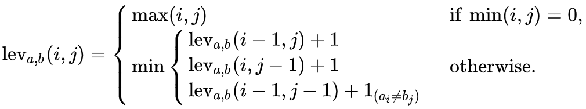

# Levenshtein

An implementation of the Levenshtein distance algorithm.

## What is it?

The **Levenshtein distance** is a measure of the difference between two strings. It is defined as the **minimum number of single-character edits** (insertions, deletions, or substitutions) required to change one string into the other.

The higher the distance, the more different the two strings are.

## Mathematical Definition

Let `a` and `b` be two strings of lengths `m` and `n` respectively. Define `d(i, j)` as the Levenshtein distance between the first `i` characters of `a` and the first `j` characters of `b`.

Then:



Where `cost = 0` if `a[i-1] == b[j-1]`, else `cost = 1`.

This can be efficiently computed using dynamic programming.

## Example

```text
kitten → sitten  = 1 substitution (k → s)
kitten → sittin  = 2 edits (k → s, e → i)
kitten → sitting = 3 edits (k → s, e → i, +g)
```

## Applications

- Spell checking
- DNA sequencing
- Natural language processing
- Plagiarism detection

## License

This project is licensed under the [MIT License](LICENSE). You are free to use, modify, and distribute this code with proper attribution.
